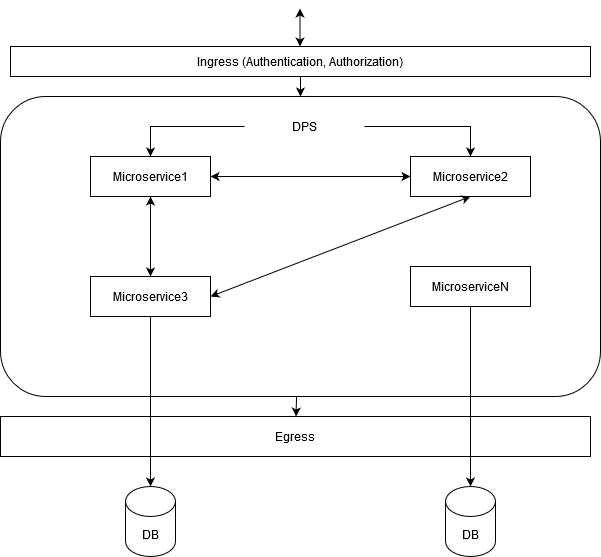
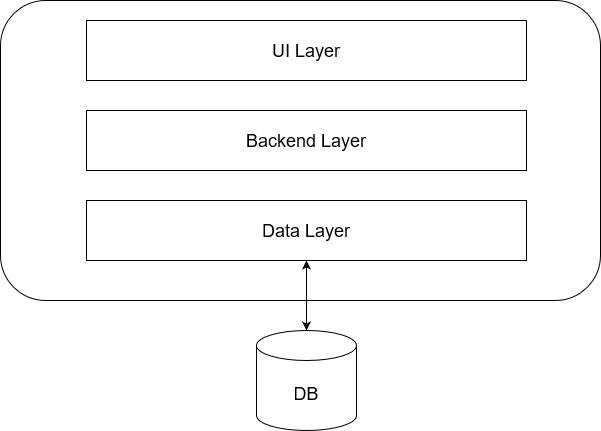
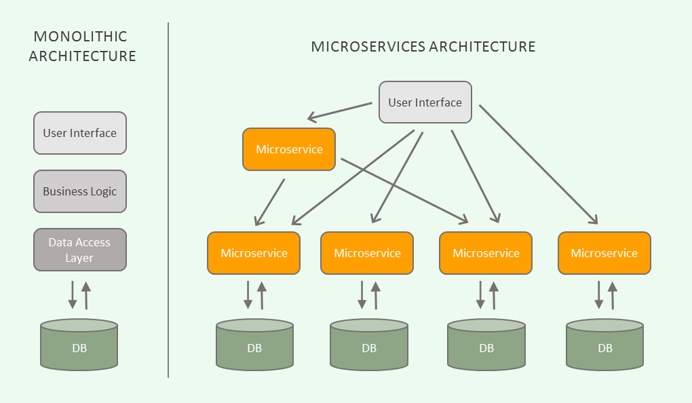
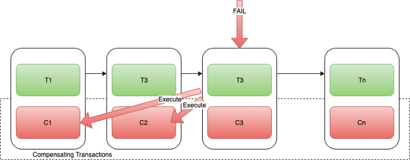
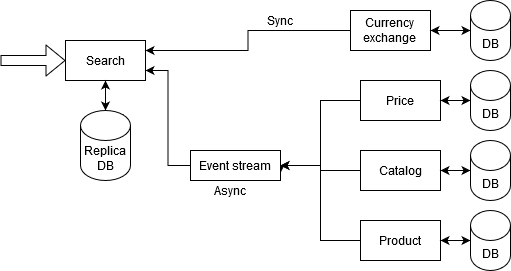
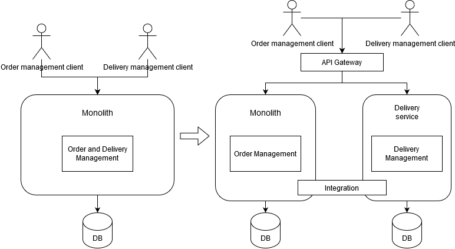
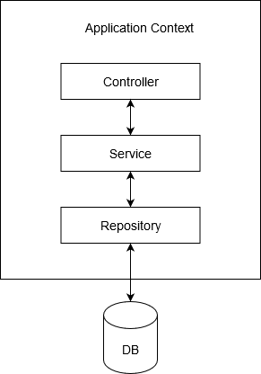

class: inverse, center, middle

# Microservice alapok

---

## Bemutatkozás

* Gellai Gábor 
* 2016 óta Telcotrend
* DXC (Telekom) csapat
* Jazz, Biller, POM DPS

---

## Telekom DPS

* Deutsche Telekom kezdeményezés
* DPS: Digital Platform Service
* Microservice halmaz
* Legkisebb üzleti egység
* Stack: Kotlin/Java 11, Spring Boot, OpenAPI, Gradle, Kafka, ELK, Docker, Kubernetes, Grafana (Prometheus), Gitlab CI/CD, Helm chart

---
class: inverse, center

## DPS architektúra



---
class: inverse, center, middle

# Monolith vs Microservice

---
class: inverse, center

## Monolith architektúra



---

## Monolith architektúra

előnyök:
* egyszerű fejlesztés: egy kódbázis
* egyszerű deploy: egy alkalmazás, egyszerű a ci/cd pipeline
* egyszerű skálázni: több példányban indítjuk az alkalmazást

hátrányok:
* idővel túl nagy lesz, nehezebb karbantartani/átlátni, lelassul a fejlesztés
* egyúttal nő a csapat mérete is
* lassul az alkalmazás build/deploy/run ideje
* skálázás költséges 
* alacsony hibatűrés: meghibásodás esetén a teljes alkalmazás leállhat
* tech stack nehezen cserélhető

---
class: inverse, center

## Microservice architektúra



---

## Microservice architektúra

előnyök:
* egymástól független kis alkalmazások: 
	* könnyebb karbantartani
	* átláthatóbb a kód, gyorsabb a fejlesztés
	* külön deployolhatók
* csapatok jobban szervezhetőek: több kisebb csapat, egymástól függetlenül dolgoznak, csapatonként egy-több microservice
* kisebb alkalmazásokra gyorsabb a build/deploy/run
* nagyobb hibatűrés: egy microservice meghibásodása esetén a többi service egészséges marad
* tech stack rugalmasság: a független service-k könnyebben cserélhetőek

hátrányok:
* rendszer komplexitása nő (infrastruktúra)
	* service kommunikációk összehangolása (Service Discovery), hibakezelés (Circuit Breaker)
	* service-k közötti interakciók tesztelése
	* fejlesztő csapatok koordinációja (szervezeti átalakítás, Conway's Law)

---

## Microservice tulajdonságok

1. Állapotfüggetlen (skálázhatóság)
2. Egy service egy (üzleti) funkció
3. DDD: Domain driven design
4. [SOLID](https://howtodoinjava.com/best-practices/solid-principles) elvek (TDD, Spring Boot segít)
5. Twelve-Factor

---

## Microservice tulajdonságok
### 6. Data consistency

* Monolith esetén egyszerű: commit/rollback
* [SAGA Pattern](https://microservices.io/patterns/data/saga.html): Lokális tranzakciók sorozata
* minden lokális tranzakció (saga) után egy event triggereli a következő lépést 
* hiba esetén kompenzációs tranzakciók meghívása:


* saga koordináció:
	* Choreography: event-ek feladása, ami további service-ket triggerel (pl. Kafka, RabbitMQ)
	* Orchestrator: külön funkció a service-k koordinációjára (pl. Zeebe)  

---

## Aszinkron kommunikáció

* ahol lehet async hívások
* példa search service:


---

## Twelve-Factor app

* egy [metodológia](https://12factor.net/) felhőbe (PaaS) telepíthető alkalmazások fejlesztésére
* Platform as a Service (pl.: AWS, Azure, OpenShift, PCF, Google Cloud, stb.)

---

## Twelve-Factor app ajánlások 1/2

* Verziókezelés
	* Egy repository alatt a teljes alkalmazás
	* több alkalmazás által használt kódrészek külön library legyen (dependency management)
* Függőségek: Külső library-ket dependency-ként kezeljük (docker, maven, gradle)
* Konfiguráció: Konfig paramétereket környezeti változókba tesszük (nem az alkalmazás része)
* Háttérszolgáltatások: Backing service-k (pl. DB) elkülönülnek az alkalmazás kódjától (csak konfig beállítás)
* Build, release, futtatás elkülönítése:
	* build stage: lefordul az alkalmazés
	* release stage: összecsomagolja a lefordult alkalmazást az adott környezet konfigjával
	* run stage: elindítjuk a release-t adott környezeten
	* mindent verziózunk, history stb.
* Folyamatok:
	* egy alkalmazás állapotfüggetlen (stateless) legyen
	* minden perzistens adatot stateful service-en (pl. DB) kell letárolni
* Port hozzárendelés: Minden alkalmazáshoz dedikált port
* Párhuzamosság: Horizontális skálázhatóság (állapotmentesség szükséges)

---

## Twelve-Factor app ajánlások 2/2

* Disposability: 
	* cél a gyors startup/shutdown
	* deploy és skálázódás miatt
* Éles és fejlesztői környezet hasonlósága:
	* fejlesztők bevonása a devops folyamatokba
	* gyors deploy
	* fejlesztő/éles környezeti eszközök egyezzenek
* Naplózás: logolás a konzolra (ELK)
* Felügyeleti folyamatok: egyszer futtatandó script-eket, módosításokat csomagoljuk az alkalmazás release-ébe

---

## Monolith refaktorálása Microservice architektúrába

* új funkciók microservice-ekbe implementálása
* meglévő funkciók kiszervezése microservice-kbe:



---
class: inverse, center, middle

# Spring Boot alapok

---

## Spring Framework tulajdonságai

* Komponensek, melyeket konténerként tartalmaz (konténer: Application Context)
* Konténer vezérli a komponensek életciklusát (pl. példányosítás)
* Konténer felügyeli a komponensek közötti kapcsolatot (Dependency Injection)
* Komponensek és kapcsolataik leírása több módon: XML, annotáció, Java kód
* 3rd party library-k integrálása az egységes modellbe
* Glue kód
* Boilerplate kódok eliminálása
* Fejlesztők az üzleti problémák megoldására koncentráljanak

---

## Háromrétegű webes alkalmazás

* Rétegek
    * Repository
    * Service
    * Controller
* HTTP kezelését web konténerre bízza, <br /> pl. Tomcat, Jetty, stb.



---

## Spring Boot

* Autoconfiguration: classpath-on lévő osztályok, 3rd party library-k, környezeti változók és
  egyéb körülmények alapján komponensek automatikus létrehozása és konfigurálása
* Saját konfiguráció írása csak akkor, ha az alapértelmezettől el szeretnénk térni
* Self-contained: az alkalmazás tartalmazza a web konténert is (pl. Tomcat)
* Nagyvállalati üzemeltethetőség: Actuatorok
    * Pl. monitorozás, metrikák, konfiguráció, beavatkozás, naplózás állítása, stb.
* Gyors kezdés: Spring Initializr [https://start.spring.io/](https://start.spring.io/)
* Starter projektek: függőségek, előre beállított verziószámokkal (tesztelt)

---

## Spring Beanek

* Spring bean: tud róla a Spring konténer
* Spring példányosítja
* Spring állítja be a függőségeit
* Alapértelmezetten singleton, egy példányban jön létre

---

## Application

* Alkalmazás belépési pontja `main()` metódussal
* `@SpringBootApplication`:
    * `@EnableAutoConfiguration`: autoconfiguration bekapcsolása
    * `@SpringBootConfiguration`: `@Configuration`: maga az osztály is tartalmazhasson további konfigurációkat
    * `@ComponentScan`: `@Component`, `@Repository`, `@Service`, `@Controller`
    annotációval ellátott

```java
@SpringBootApplication
public class EmployeesApplication {

	public static void main(String[] args) {
		SpringApplication.run(EmployeesApplication.class, args);
	}

}
```

---

## Controller

* `@Controller`: megtalálja a component scan, Spring MVC felismeri
* `@RequestMapping` milyen URL-en hallgat
    * Megadható a HTTP metódus a `method` paraméterrel
* `@ResponseBody` visszatérési értékét azonnal a HTTP válaszba kell írni (valamilyen szerializáció után)

```java
@Controller
public class EmployeesController {

    @RequestMapping("/")
    @ResponseBody
    public String helloWorld() {
        return "Hello World!";
    }
}
```

---

## Service

```java
@Service
public class EmployeesService {

    public String helloWorld() {
        return "Hello World at " + LocalDateTime.now();
    }
}
```

---

## Kapcsolatok

* Dependency injection
* Definiáljuk a függőséget, a konténer állítja be
* Függőségek definiálása:
    * Attribútum
    * Konstruktor
    * Metódus
* Legjobb gyakorlat: kötelező függőség konstruktorban
* Ha csak egy konstruktor, automatikusan megtörténik a dependency injection
* Egyéb esetben `@Autowired` annotáció

---

## Függőség a controllerben

```java
@Controller
public class EmployeesController {

    public EmployeesService employeesService;

    public EmployeesController(EmployeesService employeesService) {
        this.employeesService = employeesService;
    }

    @RequestMapping("/")
    @ResponseBody
    public String helloWorld() {
        return employeesService.helloWorld();
    }
}
```

---

## Java konfiguráció

* Ekkor nem kell a `@Service` annotáció
* `@Configuration` által ellátott osztályban
* Legjobb gyakorlat: saját bean-ek component scannel, 3rd party library-k Java konfiggal
* Legjobb gyakorlat: rétegenként külön `@Configuration` annotációval ellátott osztály

```java
@Bean
public EmployeesService employeesService() {
	return new EmployeesService();
}
```

```java
@Service
public class EmployeesService {

    public String helloWorld() {
        return "Hello Dev Tools at " + LocalDateTime.now();
    }
}
```

---

## Unit tesztelés

* JUnit 5
* POJO-ként tesztelhető (nem indít spring context-et)

```java
@Test
void testSayHello() {
    EmployeesService employeesService = new EmployeesService();
    assertThat(employeesService.sayHello()).startsWith("Hello");
}
```

---

## Unit tesztelés függőséggel

* Mockito classpath-on

```java
@ExtendWith({MockitoExtension.class})
public class EmployeesControllerTest {

    @Mock
    EmployeesService employeesService;

    @InjectMocks
    EmployeesController employeesController;

    @Test
    void testSayHello() {
        when(employeesService.sayHello()).thenReturn("Hello Mock");
        assertThat(employeesController.helloWorld()).startsWith("Hello Mock");
    }
}
```

---

class: inverse, center, middle

# REST webszolgáltatások GET művelet

---

## RESTful webszolgáltatások tulajdonságai

* Representational state transfer
* CRUD műveletek
* HTTP protokoll
* JSON formátum használata

---

## Annotációk

* `@RestController`, mintha minden metóduson `@ResponseBody` annotáció
    * Alapértelmezetten JSON formátumba
* `@RequestMapping` annotation helyett `@GetMapping`, `@PostMapping`, stb.

---

## Controller

```java
@RestController
@RequestMapping("/api/employees")
public class EmployeesController {

    public EmployeesService employeesService;

    public EmployeesController(EmployeesService employeesService) {
        this.employeesService = employeesService;
    }

    @GetMapping
    public List<EmployeeDto> listEmployees() {
        return employeesService.listEmployees();
    }
}
```

---

## URL paraméterek kezelése

* `@RequestParam` annotációval
* Kötelező, kivéve a `required = "false"` attribútum megadásakor
* Automatikus típuskonverzió


```java
public List<EmployeeDto> listEmployees(Optional<String> prefix) {
       return employeesService.listEmployees(prefix);
}
```

Elérhető a `/api/employees?prefix=Jack` címen

---

## URL részletek kezelése

* Osztályon lévő `@RequestMapping` és `@GetMapping` összeadódik

```java
@GetMapping("/{id}")
public EmployeeDto findEmployeeById(@PathVariable("id") long id) {
    return employeesService.findEmployeeById(id);
}
```

Elérhető a `/api/employees/1` címen

---
class: inverse, center, middle

# REST webszolgáltatások POST, PUT és DELETE művelet

---

## Controller POST/PUT művelettel

* `@RequestBody` annotáció - deszerializáció, alapból JSON-ből Jacksonnel

```java
@PostMapping
public EmployeeDto createEmployee(@RequestBody CreateEmployeeCommand command) {
    return employeesService.createEmployee(command);
}

@PutMapping("/{id}")
public EmployeeDto updateEmployee(@PathVariable("id") long id,
        @RequestBody UpdateEmployeeCommand command) {
    return employeesService.updateEmployee(id, command);
}
```

---

## Controller DELETE művelettel

```java
@DeleteMapping("/{id}")
public void deleteEmployee(@PathVariable("id") long id) {
    employeesService.deleteEmployee(id);
}
```

---

class: inverse, center, middle

# Státuszkódok és hibakezelés

---

## Státuszkód állítása controller metódusból

* `ResponseEntity` visszatérési típus: státuszkód, header, body, stb.

```java
@GetMapping("/{id}")
public ResponseEntity findEmployeeById(@PathVariable("id") long id) {
    try {
        return ResponseEntity.ok(employeesService.findEmployeeById(id));
    }
    catch (IllegalArgumentException iae) {
        return ResponseEntity.notFound().build();
    }
}
```

---

## 201 - CREATED státuszkód

```java
@PostMapping
@ResponseStatus(HttpStatus.CREATED)
public EmployeeDto createEmployee(@RequestBody CreateEmployeeCommand command) {
    return employeesService.createEmployee(command);
}
```

---

## ExceptionHandler

```java
@ExceptionHandler({IllegalArgumentException.class})
@ResponseStatus(value = HttpStatus.NOT_FOUND)
public void handleNotFound() {
    System.out.println("Employee not found");
}
```

---

class: inverse, center, middle

# Spring Boot konfiguráció

---

## Externalized Configuration

* Konfiguráció alkalmazáson kívül szervezése, hogy ugyanazon alkalmazás több környezetben is tudjon futni
* több forrása lehet a property-knek (az elől szereplők felülírják a később szereplőket)
    * Parancssori paraméterek
    * Operációs rendszer környezeti változók
    * `application.properties` állomány a jar fájlon kívül (`/config` könyvtár, vagy közvetlenül a jar mellett)
    * `application.properties` állomány a jar fájlon belül
* YAML formátumban `application.yaml`

---

## Konfiguráció beolvasása

* Injektálható a `@Value` annotáció használatával
* Injektálható `Environment` példánytól lekérdezhető

```java
@Value("${employees.max-number}")
private int maxNumber;
```

```java
int maxNumber = Integer.parseInt(environment.getProperty("employees.max-number"));
```

---

## ConfigurationProperties

```java
@Component
@ConfigurationProperties(prefix = "employees")
@Data
public class EmployeesConfiguration {

    private int maxNumber;
}
```

---

class: inverse, center, middle

# Spring Data JPA

---

## Spring Data JPA

* Egyszerűbbé teszi a perzisztens réteg implementálását
* Tipikusan CRUD műveletek támogatására
* Interfész alapján repository implementáció generálás
* Query JPQL
* Ismétlődő fejlesztési feladatok redukálása, *boilerplate* kódok csökkentése

---

## JpaRepository

* `save(S)`, `saveAll(Iterable<S>)`, `saveAndFlush(S)`
* `findById(Long)`, `findOne(Example<S>)`, `findAll()` különböző paraméterezésű metódusai (lapozás, `Example`), `findAllById(Iterable<ID>)`
* `getOne(ID)` (nem `Optional` példánnyal tér vissza)
* `exists(Example<S>)`, `existsById(ID)`
* `count()`, `count(Example<S>)`
* `deleteById(ID)`, `delete(S)`, `deleteAll()` üres és `Iterable` paraméterezéssel, `deleteAllInBatch()`, `deleteInBatch(Iterable<S>)`
* `flush()`

---

## Entitás

```java
@Data
@NoArgsConstructor
@AllArgsConstructor
@Entity
@Table(name = "employees")
public class Employee {

    @Id
    @GeneratedValue(strategy = GenerationType.IDENTITY)
    private long id;

    @Column(name = "emp_name")
    private String name;

    public Employee(String name) {
        this.name = name;
    }
}
```

---

## Repository

```java
public interface EmployeesRepository extends JpaRepository<Employee, Long> {

    @Query("select e from Employee e where upper(e.name) like :name")
    List<Employee> findAll(String name);

}
```

---

## Link

https://github.com/gellaig/microservice-alapok